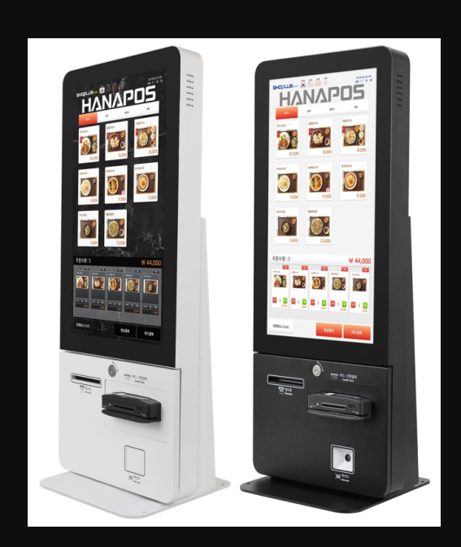
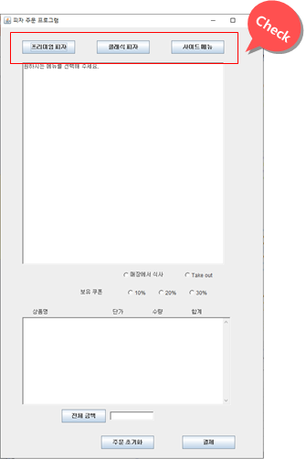
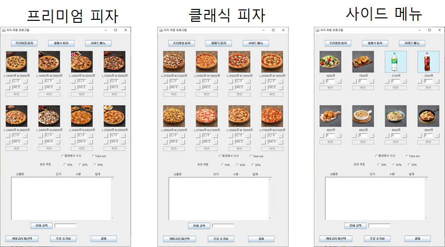
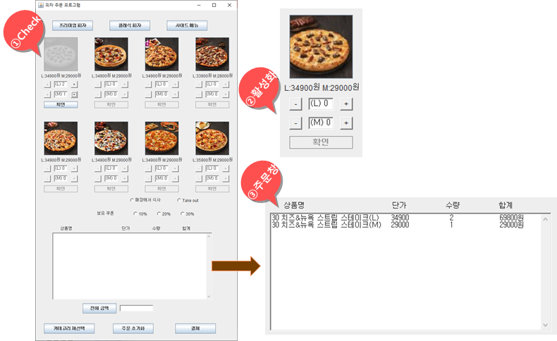
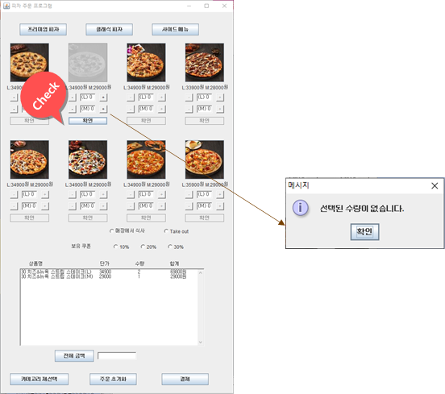
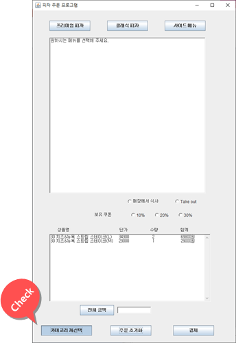
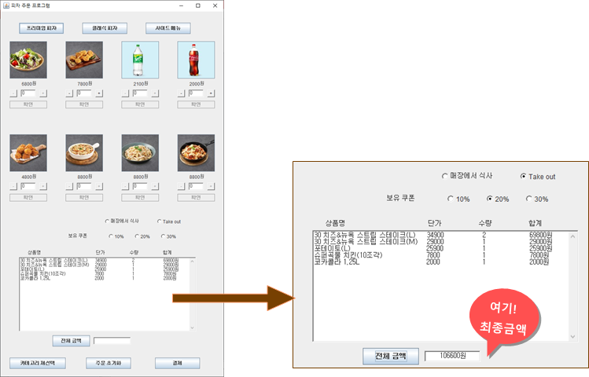
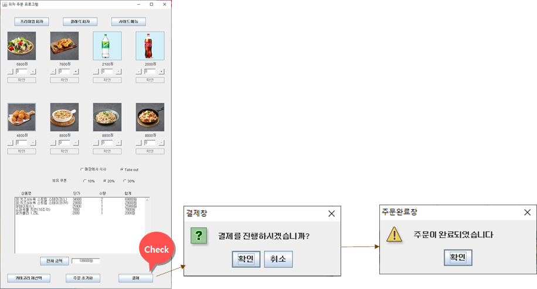

# Pizza kiosk 

요즘 많이 보이는 무인주문기(Kiosk)를 직접 java를 이용해 구현해 보았습니다. 🙂

저를 포함한 3명의 팀원으로 구성되었습니다. 

이클립스로 작업했습니다! 

## 개발일정

대학시절 만들었던 프로젝트입니다.  

### 2020.06.24 ~ 2020.06.30 

# 어플리케이션 한 줄 소개 

현실세계에서 많이 볼 수 있는 무인키오스크를 이용해 피자를 주문할 수 있게 만드는 소프트웨어를 만들어 봤습니다. 

# 프로젝트 실행 방법 및 주요기능 

#### 1. 먼저 맨 위의 카테고리 중 원하는 카테고리를 선택합니다. 

각 카테고리를 누를 경우 나오는 화면은 다음과 같습니다. 

#### 2. 카테고리 중 해당하는 메뉴를 고를 수 있는 메뉴사진들이 활성화 됩니다.

해당하는 메뉴 사진을 누르면 해당 사진이 비활성화되고 수량을 조절할 수 있는 버튼이 활성화 됩니다.

수량을 선택한 뒤 확인 버튼을 누르면 수량의 초기화 및 수량 조절 버튼이 비활성화 되고 메뉴의 사진이 활성화 되어 아래 최종 주문창에 추가됩니다. 

두 사이즈의 수량을 모두 0으로 한 뒤 확인 버튼을 누르면 다음 메세지 창이 나오는데 이 창의 확인 버튼을 누르면 메뉴 사진이 다시 활성화 됩니다.

#### 3. 초기 메뉴 화면으로 전환 

다른 카테고리의 메뉴를 고르고 싶다면 좌측 하단의 카테고리 재선택을 누르면 왼쪽과 같은 메뉴가 사라지고 프로그램 시작 당시 초기 메뉴 화면으로 바뀝니다.

#### 4. 최종금액 

모든 메뉴를 고른 뒤 보유 쿠폰에서 보유한 쿠폰의 할인율을 체크할 경우 최종 금액에서 해당하는 할인율 만큼 할인 됩니다.

그리고 Take out에 체크할 경우 추가 할인이 되지만 매장에서 식사를 체크할 경우 추가 할인이 없습니다.

마지막으로 전체 금액 버튼을 클릭하면 결제해야 하 금액이 출력됩니다.

#### 4. 결제 

마지막으로 결제 버튼을 누르면 결제 진행 확인 메세지창이 나옵니다. 

이 때 확인을 누르면 주문 완료 메세지창이 나오는데 이 창의 확인 버튼을 누르면 프로그램이 종료됩니다. 

# 기술적인 어려움

1. 카테고리를 바꿀 떄 카테고리 재선택 버튼을 통한 카테고리 변경이 아닌 카테고리 버튼만의 클릭으로 메뉴 화면을 전환하려고 했으나 해결되지 않아서 새로운 버튼 이벤트를 작성하고 카테고리 재선택 버튼을 누를 경우 변경 전의 카테고리의 메뉴를 해당하는 GUI들을 remove()메소드를 통해 제거한 뒤 새로운 카테고리에 해당하는 메뉴 GUI들을 add()메소드로 추가해야 했습니다.
2. 카테고리 버튼을 눌렀을 때 카테고리 재선택 버튼이 GUI에 메뉴 GUI와 함께 추가되도록 했는데 메뉴 GUI는 추가되는 것이 화면에 바로 반영이 되지만 카테고리 재선택 버튼은 바로 반영이 되지 않고 설정해 둔 위치에 마우스를 가져가야 버튼이 보입니다. 이 부분은 해결하지 못했습니다. 

# 느낀점 

자바언어로 팀 프로젝트를 진행한 적이 처음이라 신선하고 재미있었습니다.

특히 일상 생활에서 사용 할 수 있는 프로그램을 직접 구현해 본다는 게 너무 재미있었고 팀원들끼리 소통도 잘되서 매우 좋았습니다! 